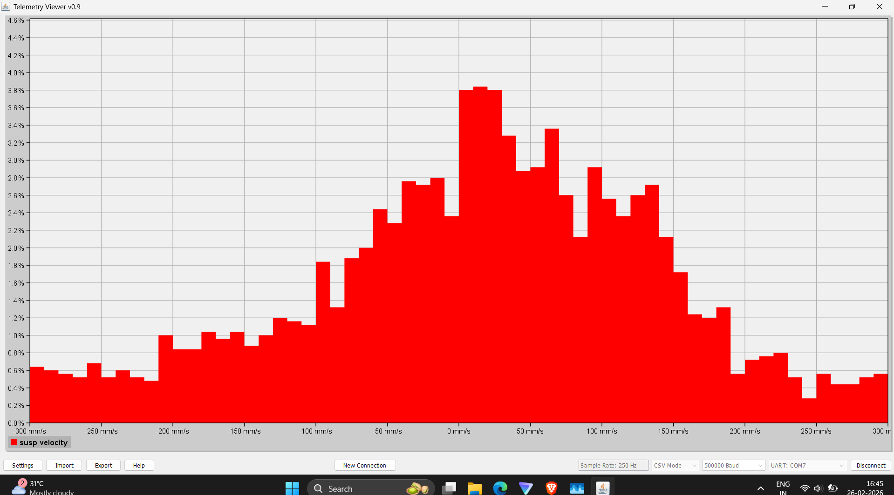
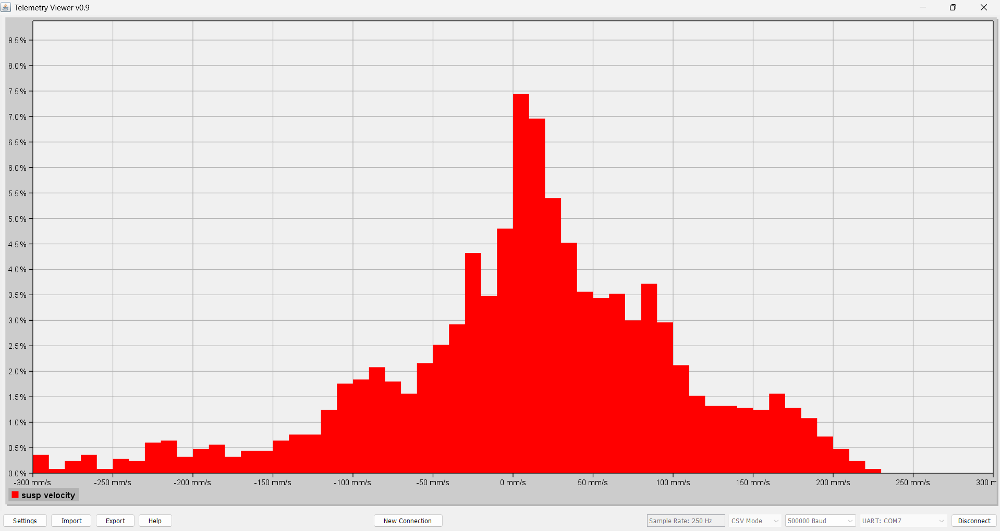
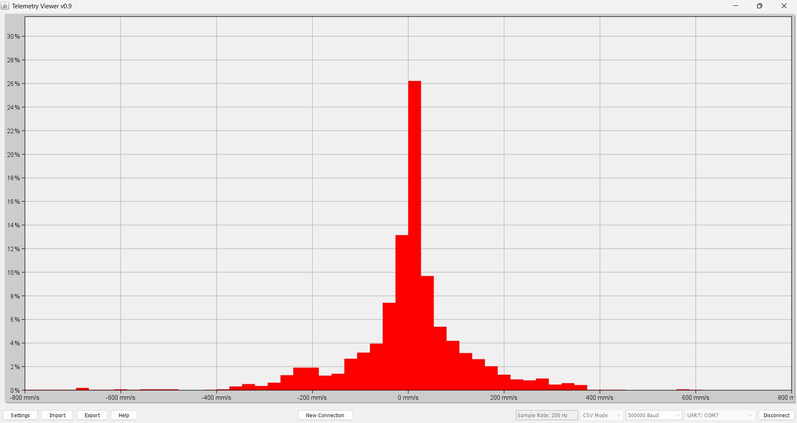

# Suspension Velocity Histograms

Velocity histograms are the primary method used in this project to objectively evaluate damping behavior. They visualize the amount of time the suspension spends moving at specific shaft speeds (mm/s).

## Setup 1: Underdamped

* **Characteristics:** Wide Gaussian distribution with long tails. 
* **Analysis:** The suspension moves freely, tracking terrain exceptionally well but lacking the high-speed damping required to prevent bottoming out. The chassis exhibits excessive wallow and post-impact bouncing.

## Setup 2: Balanced Damping

* **Characteristics:** Concentrated data in the low-to-mid speed regions with controlled tails.
* **Analysis:** Represents the optimal compromise for the off-road biased setup. It absorbs impacts without bottoming out while maintaining sufficient chassis control to prevent oscillation.

## Setup 3: Overdamped

* **Characteristics:** High concentration of data strictly around the zero-velocity axis.
* **Analysis:** The damper restricts movement too heavily, causing hydraulic lock during sharp inputs. This setup forces the tire to act as an undamped spring, severely increasing chassis harshness and reducing mechanical grip.